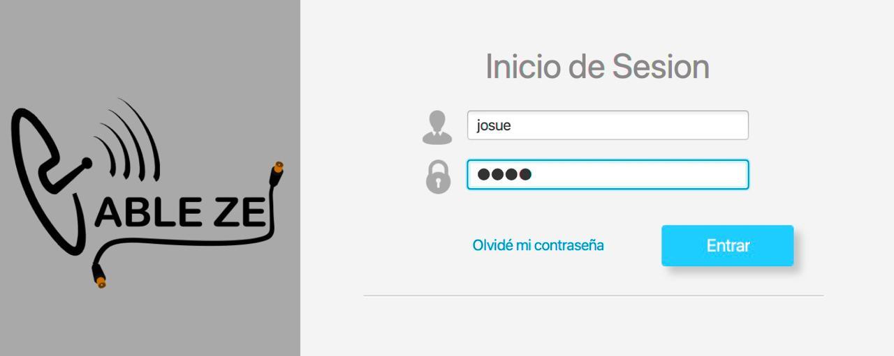
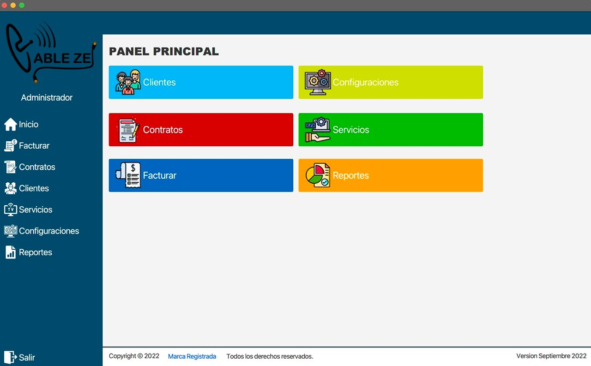

# cablezel
Un proyecto creado con el lenguaje de programación Java y Maven como gestor de dependencias, para la empresa de Cable de TV en Siuna Costa Caribe Norte.  

Este proyecto se implementa con tecnologías locales, siendo el propósito el control de la información de clientes, basado en el lenguaje de programación Java con JavaFX para el desarrollo de interfaces y el modelado de objetos de la aplicación mediante archivos XML; como parte de una arquitectura limpia se implementan patrones de diseño y arquitectónicos como: DAO y Singleton en conjunto con una herramienta de mapeo Hibernate para facilitar las transacciones con la base de datos PostgreSQL.  

## Objetivos
- [x] Crear un proyecto con Maven y JavaFX
- [x] Manipular la información de una base de datos PostgreSQL
- [x] Desarrollar la lógica de negocio de la aplicación con Java
- [x] Pruebas unitarias con JUnit e implementación de patrones de diseño
- [x] Implementar patrones arquitectónicos y de diseño

## Requisitos
- Java 11
- Maven 3.8.6
- PostgreSQL 13
- Hibernate 5.1.2
- JavaFX 16
- SceneBuilder 19
- JasperReports 6.17.0

## Instalación
1. Clonar el repositorio
```bash
git clone https://github.com/JosueMrals/cablezel.git
```
2. Crear la base de datos
```sql
CREATE DATABASE cablezel;
```
3. Crear el usuario cablezel con permisos a la base de datos
```sql
CREATE USER cablezel WITH ENCRYPTED PASSWORD 'cablezel';
GRANT ALL PRIVILEGES ON DATABASE cablezel TO cablezel;
```
4. Compilar el proyecto, si desea ejecutar la versión de desarrollo cambie a la rama develop
```bash
git checkout develop
mvn clean compile
```
5. Ejecutar el proyecto
```bash
mvn exec:java
```
6. Si desea limpiar la instalación, compilar e instalar en el repositorio local de Maven, generar el archivo .jar y ejecutar el proyecto
```bash
# el parámetro -DskipTests=true es para omitir las pruebas unitarias
mvn clean compile package install exec:java -Dmaven.test.skip=true
```
7. El usuario por defecto es `josue` y la contraseña es `1234`
Interfaz login ejecutada

8. Listo, ya puede usar la aplicación
  

## Licencia
Copyright (c) 2021 Josué Morales, Victor Zeledón  
[MIT](https://github.com/JosueMrals/cablezel/blob/main/LICENSE)

## Contribuciones
Las contribuciones son bienvenidas. Para cambios importantes, abra un problema primero para discutir qué le gustaría cambiar.

Asegúrese de actualizar las pruebas según corresponda.

## Contacto
Josué Morales
- [GitHub](https://github.com/JosueMrals)
- [Linkedin](https://www.linkedin.com/in/jous17/)
- [Twitter](https://twitter.com/JoshMorales09)

Victor Zeledón
- [GitHub](https://github.com/POXS44)

## Agradecimientos a colaboradores
- [Juan Orlando Selva](https://github.com/jselvamadrigal)
- [Yesser Miranda](https://github.com/yessermiranda13)
